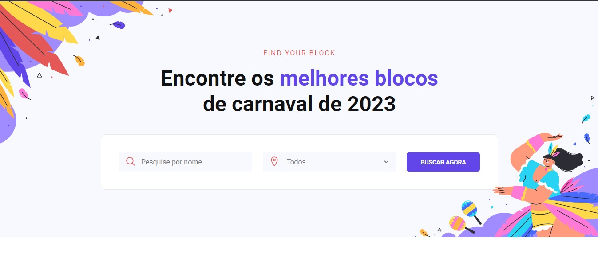
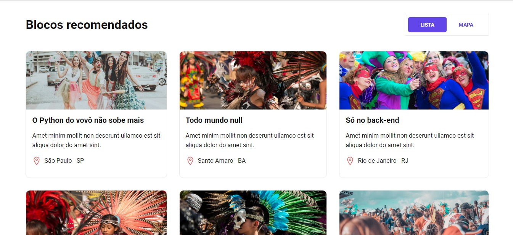
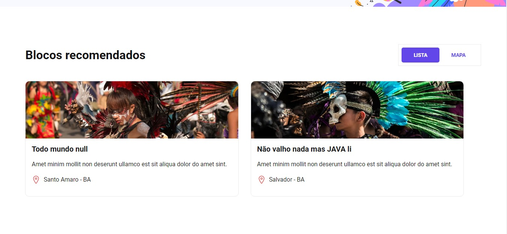
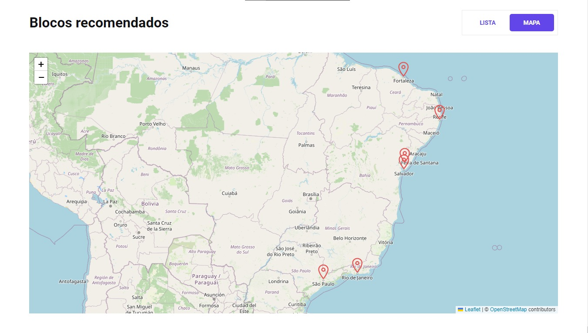
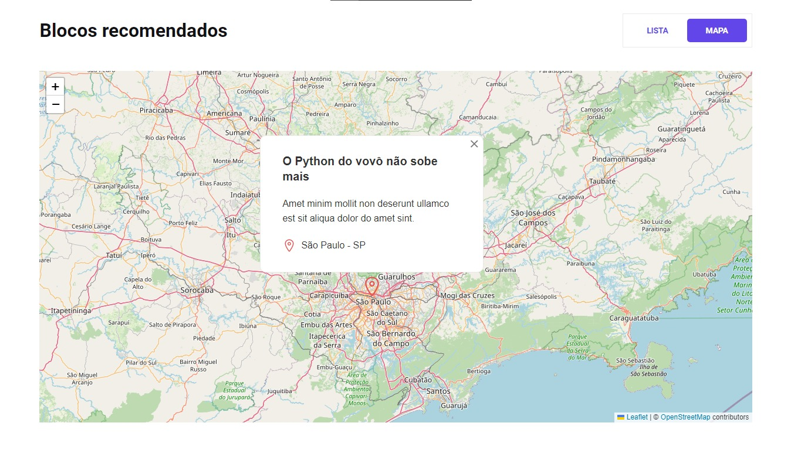
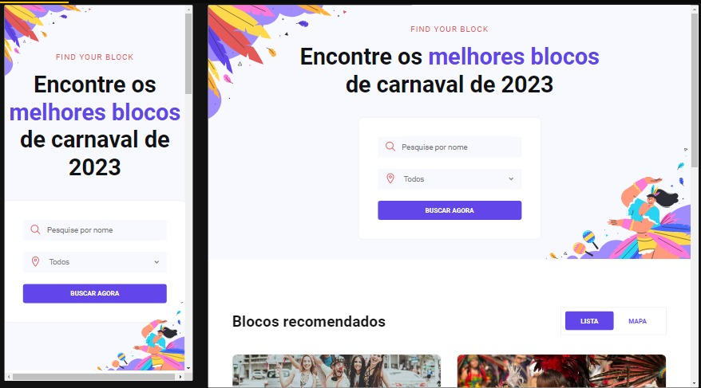

---
<h1 align="center">#boraCodar7</h1>

---

<p align="center">
  
</p>

<h1>Topics 📋</h1>

   - [Sobre 📖](#about)
   - [Deploy ✅ ](#deploy)
   - [Tecnologias 🚀](#techs)
   - [Tools 🛠️](#tools)
   - [Como rodar o projeto 🤔](#run-project)
   - [Funcionalidades 📝](#functionalities)

<h2 id="about">😀 Sobre o projeto </h2>

Esse projeto foi desenvolvido na 7° Edição do #boraCodar da Rocketseat, que semanalmente lança desafios para toda comunidade Dev. Nesse desafio com o clima de Carnaval,
a proposta foi desenvolver um site na qual foliões de carnaval possam buscar blocos mais próximos da onde estejam ou que mais se identificam.

<h2 id="about">Deploy ✅</h2>

- [Acesse o projeto](https://gregarious-platypus-155183.netlify.app/)

<h2 id="techs">🚀 Tecnologias</h2>

Projeto foi desenvolvido com as seguintes tecnologias:

-  [HTML5](https://developer.mozilla.org/pt-BR/docs/Web/HTML)
-  [CSS3](https://developer.mozilla.org/pt-BR/docs/Web/CSS)
-  [TypeScript](https://www.typescriptlang.org/)
-  [Axios](https://axios-http.com/)
-  [React-Leaflet](https://react-leaflet.js.org/)
-  [Styled-Compoments](https://styled-components.com/docs)

<h2 id="tools">🛠 Tools </h2>

As ferramentas utilizadas para desenvolver o projeto:

-  [Visual Studio Code](https://code.visualstudio.com/)
-  [Google Chrome](https://www.google.pt/intl/pt-PT/chrome)
-  [Figma](https://www.figma.com/ui-design-tool/)
-  [Vite](https://vitejs.dev/)

<h2 id="run-project">🖥 Como rodar o projeto </h2>

```bash
# - Clone this repository:
$ git clone https://github.com/felipecastrosales/Virtual-Store Virtual-Store

# - For install dependencies:
$ npm install
# or
$ yarn

# - Enter in directory:
$ cd find-your-block

# - Run the app:
$ npm run dev
# or
$ yarn dev

# - Run the server:
$ npm run server
# or
$ yarn server
```
<h2 id="functionalities">🛠 Funcionalidades </h2>

- Buscar bloco de carnaval
  - Busca por nome 
  - Busca por estado
- Exibe as informações do bloco
  - Nome, descrição, localização, imagem

<p align="center">
  
</p>

<br/>
- Filtragem para exibir somente os bloco do estados da Bahia
<br/>

<p align="center">
  
</p>

<br/>
- Opção de visualizar os blocos pelo mapa
<br/>

<p align="center">
  
</p>

<br/>
- Ao clicar nos popus é exibido as informações do bloco selecionado
<br/>

<p align="center">
  
</p>

- Responsividade para os diversos tamanhos de tela 
<p align="center">
  
</p>


😍 Criado por Alairton Junior. 

      
 
